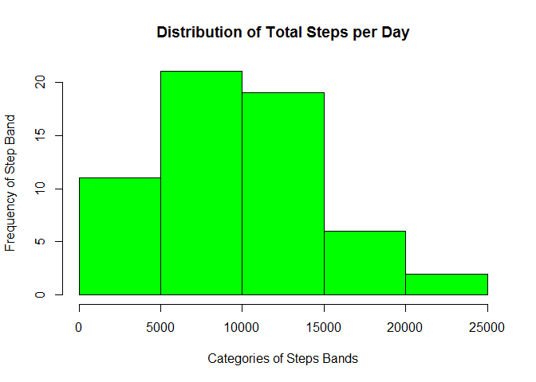
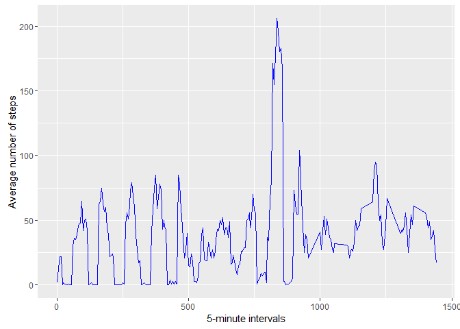
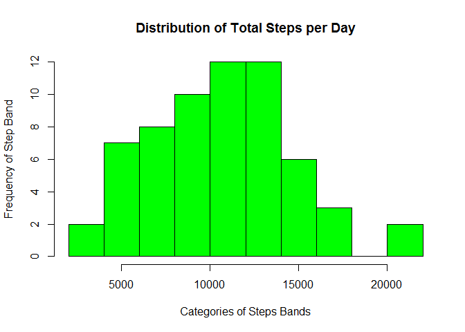
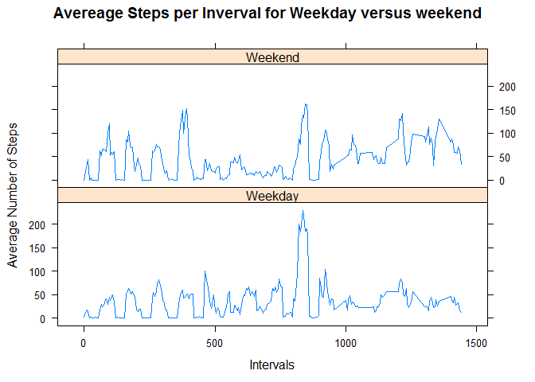

Reproducible Reporting Course Project 1
================

Overview of the course project
------------------------------

This assignment makes use of data from a personal activity monitoring device. This device collects data at 5 minute intervals through out the day. The data consists of two months of data from an anonymous individual collected during the months of October and November, 2012 and include the number of steps taken in 5 minute intervals each day.

The variables included in this dataset are: - steps: Number of steps taking in a 5-minute interval (missing values are coded as NA) - date: The date on which the measurement was taken in YYYY-MM-DD format - interval: Identifier for the 5-minute interval in which measurement was taken

The dataset is stored in a comma-separated-value (CSV) file and there are a total of 17,568 observations in this dataset.

Load the required libraries
---------------------------

``` r
library(dplyr)
library(knitr)
library(lubridate)
library(ggplot2)
```

Loading the data
----------------

The input file should be placed in the working directory. The following reads the data in.

``` r
activitydata <- read.csv("Activity.csv", header = T, sep = ",", colClasses = c("integer", "character", "integer"))
```

Structure, records and summary of the raw data
----------------------------------------------

``` r
str(activitydata)
```

    ## 'data.frame':    17568 obs. of  3 variables:
    ##  $ steps   : int  NA NA NA NA NA NA NA NA NA NA ...
    ##  $ date    : chr  "2012-10-01" "2012-10-01" "2012-10-01" "2012-10-01" ...
    ##  $ interval: int  0 5 10 15 20 25 30 35 40 45 ...

``` r
head(activitydata[1:10,])
```

    ##   steps       date interval
    ## 1    NA 2012-10-01        0
    ## 2    NA 2012-10-01        5
    ## 3    NA 2012-10-01       10
    ## 4    NA 2012-10-01       15
    ## 5    NA 2012-10-01       20
    ## 6    NA 2012-10-01       25

``` r
summary(activitydata)
```

    ##      steps            date              interval     
    ##  Min.   :  0.00   Length:17568       Min.   :   0.0  
    ##  1st Qu.:  0.00   Class :character   1st Qu.: 588.8  
    ##  Median :  0.00   Mode  :character   Median :1177.5  
    ##  Mean   : 37.38                      Mean   :1177.5  
    ##  3rd Qu.: 12.00                      3rd Qu.:1766.2  
    ##  Max.   :806.00                      Max.   :2355.0  
    ##  NA's   :2304

Tidy data set
-------------

Adjustments are required for the date and interval fields when the size of the interval field is greater than the number of minutes( ie, 1440 ) in a day. This will result in three new variable. The first is the mult field = integer(interval/1440), the second is the dateadj field which equals the date + mult and the third is the interval1 filed which equals interval-1440\*mult.

``` r
activitydata$mult <- as.integer(activitydata$interval/1440)*ifelse(activitydata$interval>1440,1,0)
activitydata$dateadj <- date(activitydata$date)+activitydata$mult
activitydata$interval1 <- activitydata$interval - (activitydata$mult*1440)
activitytidydata <- activitydata[,c(1,5,6)]
names(activitytidydata) <- names(activitydata)[1:3]
```

Structure, records and summary of the tidy data
-----------------------------------------------

``` r
str(activitytidydata)
```

    ## 'data.frame':    17568 obs. of  3 variables:
    ##  $ steps   : int  NA NA NA NA NA NA NA NA NA NA ...
    ##  $ date    : Date, format: "2012-10-01" "2012-10-01" ...
    ##  $ interval: num  0 5 10 15 20 25 30 35 40 45 ...

``` r
head(activitytidydata[1:10,])
```

    ##   steps       date interval
    ## 1    NA 2012-10-01        0
    ## 2    NA 2012-10-01        5
    ## 3    NA 2012-10-01       10
    ## 4    NA 2012-10-01       15
    ## 5    NA 2012-10-01       20
    ## 6    NA 2012-10-01       25

``` r
summary(activitytidydata)
```

    ##      steps             date               interval     
    ##  Min.   :  0.00   Min.   :2012-10-01   Min.   :   0.0  
    ##  1st Qu.:  0.00   1st Qu.:2012-10-16   1st Qu.: 300.0  
    ##  Median :  0.00   Median :2012-10-31   Median : 600.0  
    ##  Mean   : 37.38   Mean   :2012-10-31   Mean   : 622.5  
    ##  3rd Qu.: 12.00   3rd Qu.:2012-11-16   3rd Qu.: 900.0  
    ##  Max.   :806.00   Max.   :2012-12-01   Max.   :1440.0  
    ##  NA's   :2304

Determine the total number of steps taken per day
-------------------------------------------------

``` r
totalsteps <- activitytidydata %>% filter(!is.na(steps)) %>% group_by(date) %>% summarize(steps = sum(steps)) %>% print
```

    ## Source: local data frame [59 x 2]
    ## 
    ##          date steps
    ##        (date) (int)
    ## 1  2012-10-02     0
    ## 2  2012-10-03  9416
    ## 3  2012-10-04  9580
    ## 4  2012-10-05 15839
    ## 5  2012-10-06 12860
    ## 6  2012-10-07 10212
    ## 7  2012-10-08  5416
    ## 8  2012-10-09 10242
    ## 9  2012-10-10  7911
    ## 10 2012-10-11 12550
    ## ..        ...   ...

Histogram of the frequency of various step bands
------------------------------------------------

Distribution of step bands, along with the average and median number of steps per day

``` r
hist(totalsteps$steps, main = "Distribution of Total Steps per Day", xlab = "Categories of Steps Bands", ylab = "Frequency of Step Band", col = "green")
```



``` r
avgstep <- round(mean(totalsteps$steps, na.rm = T),0)
medianstep <- round(median(totalsteps$steps, na.rm = T),0)
```

The average number of steps per day is 9671 and the median number of steps per day is 9496.

Average Daily Activity Patterns
-------------------------------

1.Make a time series plot of the 5-minute interval (x-axis) and the average number of steps taken, averaged across all days (y-axis)

2.Which 5-minute interval, on average across all the days in the dataset, contains the maximum number of steps?

``` r
intervals <- activitytidydata %>% filter(!is.na(steps)) %>% group_by(interval) %>% summarize(steps = round(mean(steps),0)) %>% print 
```

    ## Source: local data frame [249 x 2]
    ## 
    ##    interval steps
    ##       (dbl) (dbl)
    ## 1         0     2
    ## 2         5    13
    ## 3        10    22
    ## 4        15    22
    ## 5        20     0
    ## 6        25     2
    ## 7        30     1
    ## 8        35     1
    ## 9        40     0
    ## 10       45     1
    ## ..      ...   ...

``` r
ggplot(data = intervals, aes(x = interval, y=steps))+geom_line(color="blue") +xlab("5-minute intervals") + ylab("Average number of steps") 
```



``` r
inter <- sum(intervals[which.max(intervals$steps),][1,1])
numstep <- sum(round(intervals[which.max(intervals$steps),][1,2],0))
```

The 5-minute interval with the largest number of steps in 835 and the number of steps associated with this interval is 206.

Imputed missing values
----------------------

``` r
missing <- which(is.na(activitytidydata$steps))
filled <- which(!is.na(activitytidydata$steps))
nummiss <- length(missing)
```

The total number of observations with missing value is 2304.

Strategy for determining missing value
--------------------------------------

``` r
missingdata <- activitytidydata[which(is.na(activitytidydata$steps)),]
filleddata <- activitytidydata[which(!is.na(activitytidydata$steps)),]
 
for ( j in 1:nrow(missingdata)){ missingdata[j,1] <- intervals[intervals$interval==missingdata[j,3],2]}
allactivitydata <- rbind(filleddata,missingdata)
```

Structure and summary of the new data file with missing values replaced by average value
----------------------------------------------------------------------------------------

note: no indication of missing value in the structure or summary

``` r
 str(allactivitydata)
```

    ## 'data.frame':    17568 obs. of  3 variables:
    ##  $ steps   : num  0 0 0 0 0 0 0 0 0 0 ...
    ##  $ date    : Date, format: "2012-10-02" "2012-10-02" ...
    ##  $ interval: num  0 5 10 15 20 25 30 35 40 45 ...

``` r
 summary(allactivitydata)
```

    ##      steps             date               interval     
    ##  Min.   :  0.00   Min.   :2012-10-01   Min.   :   0.0  
    ##  1st Qu.:  0.00   1st Qu.:2012-10-16   1st Qu.: 300.0  
    ##  Median :  0.00   Median :2012-10-31   Median : 600.0  
    ##  Mean   : 37.38   Mean   :2012-10-31   Mean   : 622.5  
    ##  3rd Qu.: 28.00   3rd Qu.:2012-11-16   3rd Qu.: 900.0  
    ##  Max.   :806.00   Max.   :2012-12-01   Max.   :1440.0

Determine the total number of steps taken per day with the imputed missing values
---------------------------------------------------------------------------------

``` r
alltotalsteps <- allactivitydata %>% filter(!is.na(steps)) %>% group_by(date) %>% summarize(steps = sum(steps)) %>% print
```

    ## Source: local data frame [62 x 2]
    ## 
    ##          date steps
    ##        (date) (dbl)
    ## 1  2012-10-01  6738
    ## 2  2012-10-02  4027
    ## 3  2012-10-03  9416
    ## 4  2012-10-04  9580
    ## 5  2012-10-05 15839
    ## 6  2012-10-06 12860
    ## 7  2012-10-07 10212
    ## 8  2012-10-08 12154
    ## 9  2012-10-09 14269
    ## 10 2012-10-10  7911
    ## ..        ...   ...

Histogram of the frequency of various step bands updated with imputed values
----------------------------------------------------------------------------

Distribution of step bands, along with the average and median number of steps per day

``` r
hist(alltotalsteps$steps, main = "Distribution of Total Steps per Day", xlab = "Categories of Steps Bands", ylab = "Frequency of Step Band", col = "green")
```



``` r
allavgstep <- round(mean(alltotalsteps$steps, na.rm = T),0)
allmedianstep <- round(median(alltotalsteps$steps, na.rm = T),0)
```

The average number of steps per day is 1.059210^{4} and the median number of steps per day is 1.05710^{4}.

Difference in activity patterns during the week versus the weekend
------------------------------------------------------------------

``` r
allactivitydata$day <- weekdays(allactivitydata$date, abbreviate = T) 
allactivitydata$fac <- as.factor(ifelse(allactivitydata$day %in% c("Sat","Sun"), "Weekend","Weekday"))
library(lattice)
intervals <- allactivitydata %>% group_by(interval,fac) %>% summarize(steps = round(mean(steps),0)) %>% print 
```

    ## Source: local data frame [498 x 3]
    ## Groups: interval [?]
    ## 
    ##    interval     fac steps
    ##       (dbl)  (fctr) (dbl)
    ## 1         0 Weekday     2
    ## 2         0 Weekend     0
    ## 3         5 Weekday    12
    ## 4         5 Weekend    17
    ## 5        10 Weekday    17
    ## 6        10 Weekend    34
    ## 7        15 Weekday    14
    ## 8        15 Weekend    44
    ## 9        20 Weekday     0
    ## 10       20 Weekend     0
    ## ..      ...     ...   ...

``` r
xyplot(steps~interval|fac, data=intervals, type = "l", layout=c(1,2), main = "Avereage Steps per Inverval for Weekday versus weekend", xlab = "Intervals", ylab = "Average Number of Steps")
```


